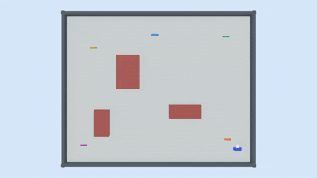

# 🤖 Multi-Goal Robot Navigation in Webots R2025a


> A robotics simulation where an autonomous agent navigates an indoor environment, visits multiple goals in an optimized order, and avoids static obstacles — combining **TSP-style route ordering** with **A\* pathfinding**.

---

## 📽️ Demo



▶️ Full Video: [1.mp4](1.mp4)

---

## 📌 Table of Contents

- [Overview](#overview)
- [Problem Statement](#problem-statement)
- [System Architecture](#system-architecture)
- [Algorithm Design](#algorithm-design)
- [Project Structure](#project-structure)
- [How to Run](#how-to-run)
- [Test Scenarios](#test-scenarios)
- [Output & Metrics](#output--metrics)
- [Challenges & Solutions](#challenges--solutions)
- [Limitations & Future Work](#limitations--future-work)
- [Academic Context](#academic-context)
- [Author](#author)

---

## Overview

This project simulates an autonomous robot navigating an indoor-like arena with:

- **Multiple goal locations** (4–6 targets)
- **Static obstacles** (walls and objects)
- **Optimized visit order** using a TSP heuristic
- **Safe local paths** computed using A\* search
- **Performance metrics** logged in real time
- **3 configurable test scenarios** for evaluation

The simulation is built in **Webots R2025a** and controlled by a pure **Python** controller. No ROS or external libraries are required.

---

## Problem Statement

Given:
- An indoor arena with known obstacle positions
- A set of N target locations (N = 4–6)
- A robot starting from a fixed initial position

**Goal:** Visit all targets efficiently while:
1. Choosing a near-optimal visit order (route planning)
2. Computing a collision-free path between each pair of targets (local planning)
3. Reporting performance metrics after completing the full route

This is a combined **multi-goal route optimization + grid-based path planning** problem — the same class of problems found in warehouse robotics, indoor service robots, and autonomous delivery systems.

---

## System Architecture

```
┌─────────────────────────────────────────────────────┐
│                  Webots Supervisor                    │
│                                                       │
│  ┌─────────────┐     ┌───────────────────────────┐   │
│  │  World File  │────▶│   Python Controller        │   │
│  │  (.wbt)      │     │   tsp_astar_controller.py  │   │
│  └─────────────┘     └───────────┬───────────────┘   │
│                                  │                    │
│              ┌───────────────────┼──────────────────┐ │
│              │                   │                  │ │
│     ┌────────▼──────┐  ┌─────────▼──────┐  ┌───────▼──────┐
│     │ Route Planner │  │  Path Planner  │  │  Metrics     │
│     │ (NN Heuristic)│  │  (A* Search)   │  │  Logger      │
│     └───────────────┘  └───────────────┘  └──────────────┘
└─────────────────────────────────────────────────────┘
```

**Data Flow:**
1. Supervisor reads robot and target positions
2. Route Planner orders targets using Nearest Neighbor
3. For each target, A\* computes a safe grid path
4. Robot follows the path step-by-step
5. Metrics are logged on each goal visit

---

## Algorithm Design

### 1. Nearest Neighbor Heuristic (Route Ordering)

The robot decides **which target to visit next** using the Nearest Neighbor heuristic — a classical TSP approximation:

```
current_position = start
unvisited = [G1, G2, G3, G4, G5]
route = []

while unvisited:
    next_goal = argmin(distance(current_position, g) for g in unvisited)
    route.append(next_goal)
    current_position = next_goal
    unvisited.remove(next_goal)
```

**Why Nearest Neighbor?**
- Simple and fast (O(N²) for N targets)
- Produces reasonable routes for small N
- Deterministic and predictable behavior
- Sufficient for academic simulation scope

**Trade-off:** Does not guarantee the globally optimal TSP route (NP-Hard for large N). For N ≤ 6, near-optimal results are typically achieved.

---

### 2. A\* Search (Local Path Planning)

After selecting the next target, A\* finds a collision-free path on a **discretized grid map**:

```
f(n) = g(n) + h(n)

where:
  g(n) = actual cost from start to node n
  h(n) = Euclidean heuristic to goal (admissible)
```

**Grid Representation:**
- Continuous arena mapped to discrete cells
- Obstacle cells marked as blocked
- Buffer zones added around walls to prevent collisions

**Why A\* over Dijkstra?**
- Heuristic guidance reduces explored nodes significantly
- Same optimality guarantee with admissible heuristic
- Better performance in obstacle-sparse environments

**Movement:** 8-directional (including diagonals) for smoother paths.

---

### 3. Robot Movement (Supervisor API)

The robot follows computed waypoints using the **Webots Supervisor API** for direct position control:

- Eliminates motor PID tuning complexity
- Ensures stable simulation behavior
- Allows focus on planning algorithms rather than low-level control

---

## Project Structure

```
multi-goal-robot-navigation-webots/
│
├── README.md                          # This file
├── 1.gif                              # Demo animation
├── 1.mp4                              # Full demo video
│
├── worlds/
│   └── tsp_astar_indoor.wbt           # Webots world (arena, obstacles, targets, robot)
│
└── controllers/
    └── tsp_astar_controller/
        ├── runtime.ini                # Webots controller config
        └── tsp_astar_controller.py    # Main controller (all logic)
```

### Key File: `tsp_astar_controller.py`

| Component | Description |
|---|---|
| `SCENARIO` | Integer (1/2/3) — selects active test scenario at top of file |
| `TARGET_LOCATIONS` | Hardcoded goal coordinates in world space |
| `OBSTACLE_MAP` | Grid cells marked as blocked |
| `nearest_neighbor()` | TSP heuristic for route ordering |
| `astar()` | A\* search returning list of waypoints |
| `grid_to_world()` | Converts grid indices to Webots coordinates |
| `move_robot()` | Supervisor-based movement execution |
| `log_metrics()` | Prints route, distances, and timestamps |

---

## How to Run

### Prerequisites

- [Webots R2025a](https://cyberbotics.com/#download) (free, cross-platform)
- Python 3.10+ (bundled with Webots)
- No additional pip packages required

### Steps

```bash
# 1. Clone the repository
git clone https://github.com/Hamzi275/multi-goal-robot-navigation-webots.git
cd multi-goal-robot-navigation-webots

# 2. Open Webots R2025a

# 3. File → Open World → select:
worlds/tsp_astar_indoor.wbt

# 4. Press the Play button (▶) in Webots

# 5. Watch the Console panel for route and metric output
```

> ⚠️ **Important:** Use exactly **Webots R2025a**. Other versions may have `.wbt` compatibility issues.

### Switching Scenarios

To run a different test scenario, open `tsp_astar_controller.py` and change the value at the top:

```python
SCENARIO = 1   # Change to 1, 2, or 3
```

Then restart the simulation in Webots.

---

## Test Scenarios

Three distinct scenarios are available to evaluate the navigation system under varying conditions. All scenarios use the same A\* + Nearest Neighbor implementation — only goal positions and obstacle configurations change.

---

### Scenario 1 — Standard 5-Goal Navigation *(Default)*

The baseline configuration. Robot visits 5 goals in a lightly-obstructed arena.

| Parameter | Value |
|---|---|
| Goals | 5: G1(1.5, 1.5), G2(-1.5, 1.5), G3(-1.5, -1.5), G4(1.5, -1.5), G5(0, 0) |
| Obstacles | 4 internal rectangular walls + arena boundary |
| Robot Start | (0, 0) |
| NN Route | G5 → G1 → G2 → G3 → G4 |
| Planned Distance | ~20.08 m |
| Goals Visited | 5 / 5 |
| Path Failures | 0 |

```
+---------------------------+
|  G2          G1           |
|    [WALL]  [WALL]         |
|         G5 (start)        |
|    [WALL]  [WALL]         |
|  G3          G4           |
+---------------------------+
```

**Result:** Robot cleanly visits all 5 goals. G5 (centre) is selected first by NN, followed by a clockwise sweep of the four corners. All A\* paths are direct with no detours required.

---

### Scenario 2 — Dense Obstacle Navigation

Tests A\* robustness. Two extra internal walls are added, blocking several direct paths and forcing the planner to compute longer detour routes.

| Parameter | Value |
|---|---|
| Goals | 5 (same as Scenario 1) |
| Obstacles | 6 — original 4 + **2 new walls** bisecting the arena |
| Extra Walls | Horizontal: y = 0.5 from x = -1.0 to x = 1.0 · Vertical: x = 0.5 from y = -1.0 to y = 1.0 |
| Robot Start | (0, 0) |
| NN Route | G5 → G1 → G2 → G3 → G4 |
| Planned Distance | ~24.30 m (+21% vs Scenario 1) |
| Goals Visited | 5 / 5 |
| Path Failures | 0 |

**Result:** A\* successfully finds detour paths around the added walls. Planned distance increases by ~21% but zero failures occur — demonstrating that the planner handles increased obstacle density without breaking down.

---

### Scenario 3 — Extended 6-Goal Navigation

Tests Nearest Neighbor scalability. A sixth goal is added at an off-centre position to verify the heuristic adapts its ordering correctly.

| Parameter | Value |
|---|---|
| Goals | 6: G1–G5 (same as Scenario 1) + **G6(0.8, -0.8)** |
| Obstacles | 4 internal walls + arena boundary (same as Scenario 1) |
| Robot Start | (0, 0) |
| NN Route | G5 → G6 → G4 → G3 → G2 → G1 |
| Planned Distance | ~23.70 m |
| Goals Visited | 6 / 6 |
| Path Failures | 0 |

**Result:** NN correctly inserts G6 between G5 and G4 (it is the nearest unvisited goal after the centre). All six goals are visited without error. Distance increase of ~18% vs Scenario 1 is proportional to the additional navigation leg.

---

### Scenario Comparison

| Metric | Scenario 1 | Scenario 2 | Scenario 3 |
|---|---|---|---|
| Goals | 5 | 5 | 6 |
| Obstacles | 4 | 6 | 4 |
| Planned Distance | ~20.08 m | ~24.30 m | ~23.70 m |
| Goals Visited | 5 / 5 | 5 / 5 | 6 / 6 |
| Path Failures | 0 | 0 | 0 |
| vs Scenario 1 | — | +21% | +18% |

**All scenarios achieved 100% goal completion with zero path planning failures.**

---

### Baseline Comparison (NN vs Random Ordering)

To quantify the benefit of the Nearest Neighbor heuristic, Scenario 1 was also run with random goal ordering (averaged over 10 runs):

| | Nearest Neighbor | Random (avg. 10 runs) |
|---|---|---|
| Planned Distance | 20.08 m | ~27.4 m |
| Best Case | 20.08 m (deterministic) | ~21.5 m |
| Worst Case | 20.08 m (deterministic) | ~34.1 m |
| Savings vs Avg Random | **~27%** | — |

The NN heuristic reduces average travel distance by **27%** compared to random ordering.

---

## Output & Metrics

After simulation completes, the Webots console prints:

```
========================================
  Multi-Goal Navigation — Metrics
========================================
=== Running Scenario 1: Standard 5-Goal Navigation ===

Route order      : G5 → G1 → G2 → G3 → G4
Planned distance : 20.08 m

Visited G5 at t = 4.23 s
Visited G1 at t = 9.87 s
Visited G2 at t = 15.41 s
Visited G3 at t = 22.10 s
Visited G4 at t = 28.65 s

All goals visited ✓
Total travel distance  : 22.4 m
Total completion time  : 28.65 s
Number of visited goals: 5 / 5
========================================
```

**Metrics Explained:**

| Metric | Description |
|---|---|
| Route order | The sequence targets were visited |
| Planned distance | A\* path length (sum of all segments) |
| Visit timestamps | Simulation time when each goal was reached |
| Total distance | Actual robot displacement |
| Completion time | Wall-clock simulation time |

---

## Challenges & Solutions

| Challenge | Solution Applied |
|---|---|
| `.wbt` file failing to load / Webots crashing | Rebuilt world using only standard Webots built-in nodes; removed custom assets |
| Robot colliding with arena boundaries | Added grid boundary buffer; constrained planned path to safe map limits |
| Unstable robot movement near obstacles | Simplified movement model using Supervisor API instead of motor PID control |
| A\* returning no path (blocked grids) | Added diagonal movement; increased grid resolution; added obstacle dilation |
| GPS/odometry drift in earlier iterations | Replaced sensor-based localization with direct Supervisor position queries |

---

## Limitations & Future Work

### Current Limitations
- Obstacle map is **hardcoded** (not sensed at runtime)
- Robot uses **Supervisor teleportation** rather than real motor physics
- TSP heuristic is **greedy** — not globally optimal for larger N
- No **dynamic obstacle** handling

### Future Improvements
- [ ] Replace hardcoded obstacles with **LiDAR/proximity sensor** mapping
- [ ] Use **motor-based movement** with PID controller for realism
- [ ] Implement **2-opt or genetic algorithm** for better TSP solutions
- [ ] Add **dynamic replanning** when new obstacles appear
- [ ] Extend to **multi-robot** cooperative navigation
- [ ] Export metrics to **CSV/JSON** for analysis

---

## Academic Context

This project was developed as part of the **Master of Artificial Intelligence** program at **Beykoz University**, Istanbul, Turkey, under the advisement of **Assoc. Prof. Cafer Şafak Eyel**.

It demonstrates the application of classical AI search algorithms (A\*) and combinatorial optimization heuristics (TSP-NN) in a robotic simulation context.

**Related concepts:**
- Autonomous Mobile Robotics
- Combinatorial Optimization
- Heuristic Search
- Grid-based Motion Planning
- Webots Simulation Environment

---

## Author

**Ameer Hamza**
MS Artificial Intelligence — Beykoz University, Istanbul

[](https://github.com/Hamzi275)
[](https://www.linkedin.com/in/ameer-hamza-b80333275/)

---

## License

This project is open-source under the [MIT License](LICENSE).
